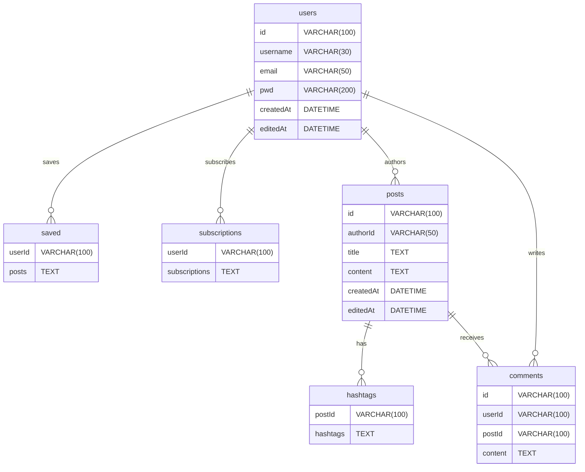

# Домашнее задание 2
#### Автор: Гриценко Глеб Михайлович 11 - И - 3

### DDL

```mermaid
erDiagram
    users {
        id VARCHAR(100)
        username VARCHAR(30)
        email VARCHAR(50)
        pwd VARCHAR(200)
        createdAt DATETIME
        editedAt DATETIME
    }

    posts {
        id VARCHAR(100)
        authorId VARCHAR(50)
        title TEXT
        content TEXT
        createdAt DATETIME
        editedAt DATETIME
    }

    hashtags {
        postId VARCHAR(100)
        hashtags TEXT
    }

    saved {
        userId VARCHAR(100)
        posts TEXT
    }

    subscriptions {
        userId VARCHAR(100)
        subscriptions TEXT
    }

    comments {
        id VARCHAR(100)
        userId VARCHAR(100)
        postId VARCHAR(100)
        content TEXT
    }

    posts ||--o{ hashtags : "has"
    users ||--o{ saved : "saves"
    users ||--o{ subscriptions : "subscribes"
    users ||--o{ posts : "authors"
    users ||--o{ comments : "writes"
    posts ||--o{ comments : "receives"
```
